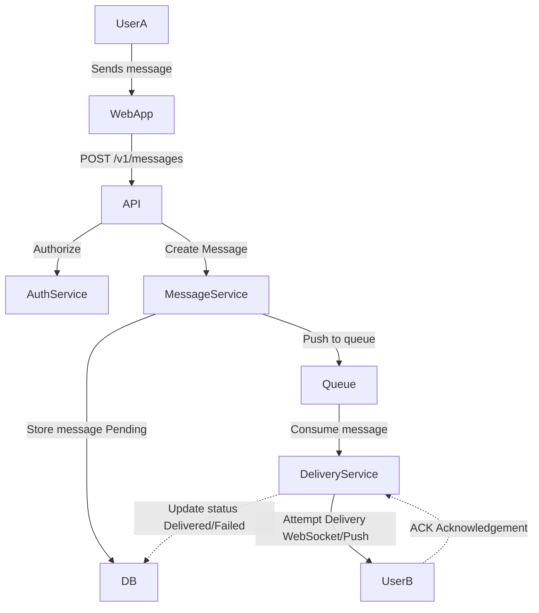
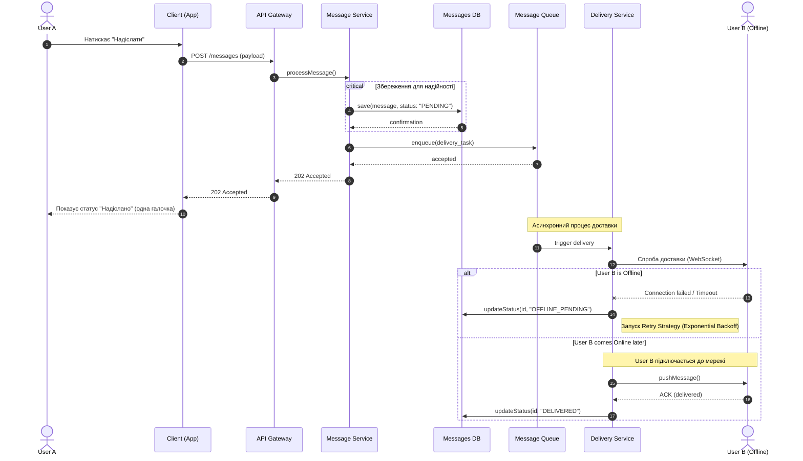
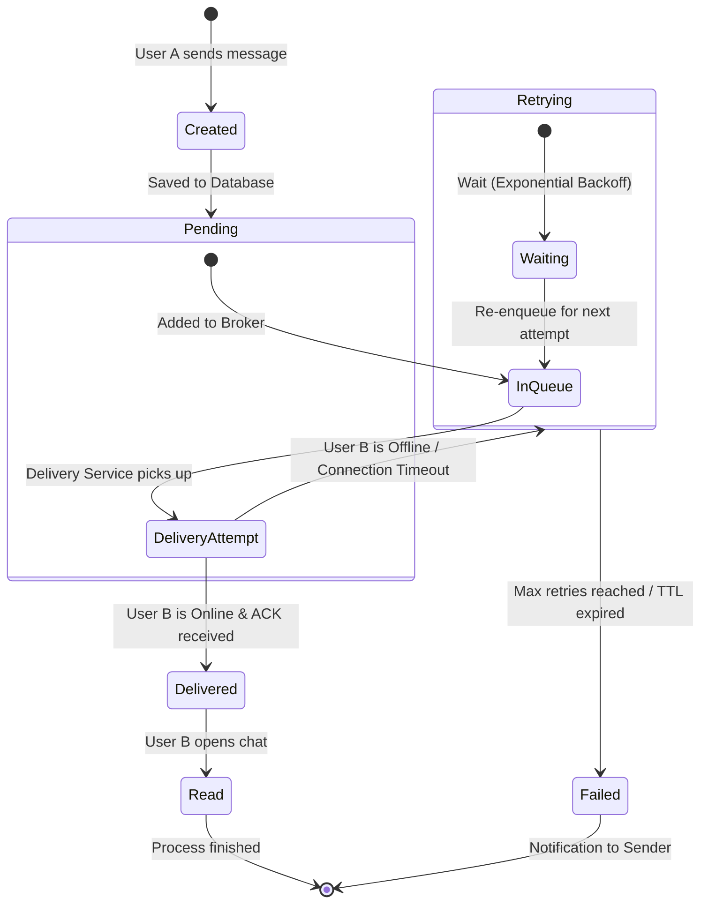

### 1.Component Diagram

```mermaid
graph TD
UserA -->|Sends message| WebApp
    WebApp -->|POST /v1/messages| API
    API -->|Authorize| AuthService
    API -->|Create Message| MessageService
    MessageService -->|Store message Pending| DB
    MessageService -->|Push to queue| Queue
    Queue -->|Consume message| DeliveryService
    DeliveryService -->|Attempt Delivery WebSocket/Push| UserB
    DeliveryService -.->|Update status Delivered/Failed| DB
    UserB -.->|ACK Acknowledgement| DeliveryService
```

### 2. Sequence Diagram

```mermaid
sequenceDiagram
    autonumber
    actor A as User A
    participant C as Client (App)
    participant API as API Gateway
    participant MS as Message Service
    participant DB as Messages DB
    participant Q as Message Queue
    participant DS as Delivery Service
    actor B as User B (Offline)

    A->>C: Натискає "Надіслати"
    C->>API: POST /messages (payload)
    
    API->>MS: processMessage()
    
    critical Збереження для надійності
        MS->>DB: save(message, status: "PENDING")
        DB-->>MS: confirmation
    end

    MS->>Q: enqueue(delivery_task)
    Q-->>MS: accepted

    MS-->>API: 202 Accepted
    API-->>C: 202 Accepted
    C-->>A: Показує статус "Надіслано" (одна галочка)

    Note over Q, DS: Асинхронний процес доставки
    
    Q->>DS: trigger delivery
    DS->>B: Спроба доставки (WebSocket)
    
    alt User B is Offline
        B--xDS: Connection failed / Timeout
        DS->>DB: updateStatus(id, "OFFLINE_PENDING")
        Note right of DS: Запуск Retry Strategy (Exponential Backoff)
    else User B comes Online later
        Note over B, DS: User B підключається до мережі
        DS->>B: pushMessage()
        B-->>DS: ACK (delivered)
        DS->>DB: updateStatus(id, "DELIVERED")
    end
```

### 3. State Diagram

```mermaid
stateDiagram-v2
    [*] --> Created: User A sends message
    
    Created --> Pending: Saved to Database
    
    state Pending {
        [*] --> InQueue: Added to Broker
        InQueue --> DeliveryAttempt: Delivery Service picks up
    }
    
    DeliveryAttempt --> Delivered: User B is Online & ACK received
    
    DeliveryAttempt --> Retrying: User B is Offline / Connection Timeout
    
    state Retrying {
        [*] --> Waiting: Wait (Exponential Backoff)
        Waiting --> InQueue: Re-enqueue for next attempt
    }
    
    Retrying --> Failed: Max retries reached / TTL expired
    
    Delivered --> Read: User B opens chat
    
    Read --> [*]: Process finished
    Failed --> [*]: Notification to Sender
```
