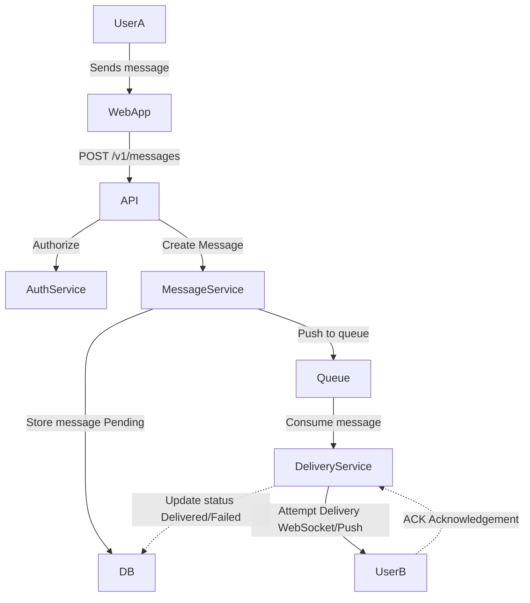

```mermaid
graph TD
UserA -->|Sends message| WebApp
    WebApp -->|POST /v1/messages| API
    API -->|Authorize| AuthService
    API -->|Create Message| MessageService
    MessageService -->|Store message Pending| DB
    MessageService -->|Push to queue| Queue
    Queue -->|Consume message| DeliveryService
    DeliveryService -->|Attempt Delivery WebSocket/Push| UserB
    DeliveryService -.->|Update status Delivered/Failed| DB
    UserB -.->|ACK Acknowledgement| DeliveryService
```
